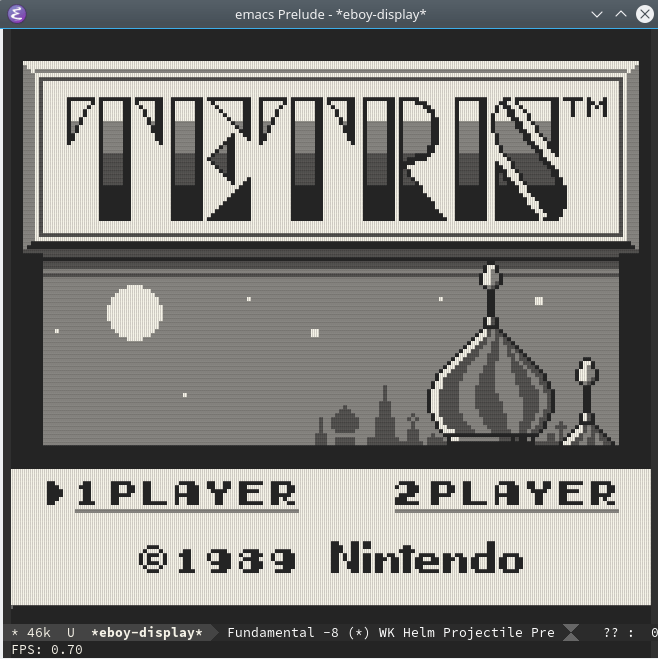

# Eboy - Emacs Gameboy Emulator

A Nintendo Gameboy emulator for Emacs.
This is a work in progress!
Just got Tetris starting up, not tested with anything else.



It currently runs a constant loop without delay.
To get out of this loop, use the common C-g command.

The display is drawn using unicode, by default it is set for dark theme.
Use the unicode list below when you have a light theme installed in Emacs.

``` emacs-lisp
(setq eboy-display-unicode-list eboy-display-unicode-list-light-theme)
```

It has frameskip enabled, by default set to 20.

## Why?
I always wanted to learn how to a make an emulator and want learn how to write packages for Emacs.
So here my first emulator and first emacs package.

## Prerequisites

Emacs :)

## Installing

For now just buffer evaluate `eboy-macros.el`, `eboy-cpu.el` and `eboy.el`.

## Usage

Load a rom using the `M-x eboy-load-rom` command

  | Gameboy     | Eboy     |
  |------------:|---------:|
  | Start       | Enter    |
  | Select      | Space    |
  | B           | D        |
  | A           | S        |
  | down        | k        |
  | up          | i        |
  | left        | j        |
  | right       | l        |
